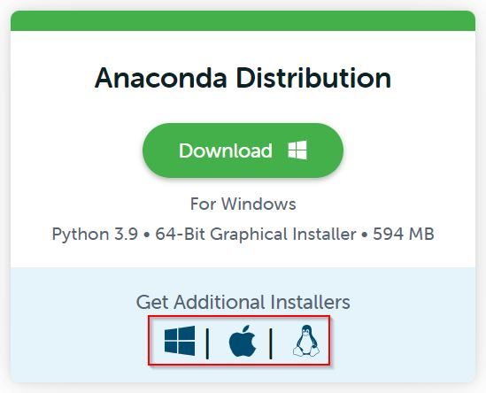

# BlackJack Simulation through lens of Monte Carlo

## Overview

Blackjack is a widely played casino game. The goal of the player is to attain a sum of dealt cards to be higher than that of a dealer, yet still under 21 with partially known cards. In the present day, the game can also be played on mobile devices, which was made possible through modern mathematics and technology. Blackjack’s major idea is the house having the edge in most of the cases. The discovery of probabilistic nature of the Black Jack by Edward O. Thorp combined with, the ability to model a card game on the computers for large samples based on Monte carlo method, there has been extensive exploration of the game in order to find an optimal solution to beat the house. The study is split into three parts – 

1.	Single experiment of online Blackjack game
2.	Hit/Stand strategy prediction using First visit Monte Carlo
3.	Optimal policy determination using Constant alpha First Visit

There are two jupyter notebooks (.ipynb) - 

1. Blackjack - Gaming interface
2. Monte Carlo - Studying blackjack outcomes and strategies using reinforcement learning

## Getting started 

To get the project up and running, please follow the below steps - 

1. Clone the repository: 
```sh 
git clone https://github.com/ACM40960/project-21200802.git
  ```
2. Go to link - https://www.anaconda.com/products/distribution#windows and download anaconda based on the operating system. 
<div align="center">
  
 </div>
<br> 
3. Open the downloaded file and begin installation by clicking next as they appear and finish button.
<br> 
4. Next, open the Anaconda navigator and launch the jupyter notebook 
5. <div align="center">
  <p float="left">
  
  
  </p>
  </div>
  <br>
5. Navigate to the folder where the files were downloaded and open both .ipynb extension files - Blackjack and Monte Carlo 
6. Run Blackjack file for playing the game and Monte carlo for simulations. 

## Blackjack Game.ipynb
1. 
 
## Monte Carlo.ipynb

1. Open anaconda3 terminal and install gym package: 
```sh 
pip install gym
  ```
2. Locate the gym package installation: 
```sh 
pip show gym
  ```
3. Inside the Monte carlo jupyter notebook change the path accordingly.
<div align="center">
  
 </div>
<br> 
4. If 'Blackjack-v1' throws error in gym.make() method, then change it as 'Blackjack-v0'.
<div align="center">
  
 </div>
<br>
5. 
